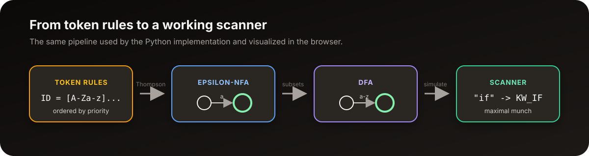

# Lexical Analyzer Visualizer

An interactive lexical analyzer that builds the complete recognizer pipeline from scratch:

**regular expression -> epsilon-NFA -> DFA -> maximal-munch scanner**

The original analyzer was developed as a CSC339 Theory of Computation project at King Saud University. This version keeps the same Python implementation and adds a browser interface for editing token specifications, inspecting automata, scanning source code, and tracing the scanner one character at a time.

<p align="center">
  
</p>

> The browser runs the real Python implementation through Pyodide. There is no backend service and no lexer-generator library behind the visualizations.

## Why this project exists

Lexical analysis is often introduced as a finished compiler component. This project opens that component and shows how it is built. A token such as `NUM = [0-9]+(\.[0-9]+)?` begins as a regular expression, becomes an epsilon-NFA through Thompson's construction, becomes a DFA through subset construction, and is finally used by a maximal-munch scanner.

The result is both a working lexer and a study tool for the theory behind it.

## Features

- Edit token names and regular expressions directly in the browser.
- Reorder token specifications by dragging rows. Earlier rows have higher priority.
- Build one combined NFA and its equivalent DFA.
- Visualize individual token NFAs, the combined NFA, and the DFA.
- Scan multi-line source text and report lexeme, token, line, and column.
- Highlight recognized lexemes by token class.
- Trace maximal munch one transition at a time, by token, or automatically.
- Adjust trace speed and pause or reset an active trace.
- Preserve token specifications, source text, and theme in local browser storage.
- Use a responsive dark or light interface with keyboard shortcuts.

## The pipeline

| Stage | What the implementation does | Main idea |
| --- | --- | --- |
| Regex preprocessing | Expands supported character classes, inserts explicit concatenation, and converts infix regex to postfix | Shunting-yard algorithm |
| Thompson construction | Evaluates the postfix expression and combines small fragments into one epsilon-NFA per token | Local construction rules |
| NFA combination | Adds one start state with epsilon transitions to every token NFA | Parallel recognition |
| Subset construction | Treats each reachable epsilon-closed set of NFA states as one DFA state | Determinization |
| Scanning | Remembers the latest accepting state and continues until the next transition fails | Maximal munch |

### Longest match and priority

Two rules make overlapping token definitions deterministic:

1. Choose the longest prefix accepted by any token.
2. If several tokens accept that same prefix, choose the token listed first.

For example, `==` is emitted as `EQ` instead of two `ASSIGN` tokens because it is longer. The text `if` is emitted as `KW_IF` instead of `ID` when `KW_IF` appears earlier in the specification list.

<p align="center">
  
</p>

## Supported regular expressions

| Syntax | Meaning | Example |
| --- | --- | --- |
| `ab` | Concatenation | `int` |
| `a\|b` | Union | `a\|b` |
| `a*` | Zero or more | `[A-Za-z0-9_]*` |
| `a+` | One or more | `[0-9]+` |
| `a?` | Zero or one | `(\.[0-9]+)?` |
| `( ... )` | Grouping | `(ab\|c)*` |
| `[a-z]`, `[A-Z]`, `[0-9]` | Supported character classes | `[A-Za-z][A-Za-z0-9_]*` |
| `\+`, `\*`, `\(` | Escaped literal metacharacters | `\+` |

Character classes are expanded by the project code rather than delegated to Python's `re` module.

## Run locally

The application is static, but it must be served over HTTP so the browser can load Pyodide and the Python modules.

```powershell
git clone https://github.com/SultanAbdulaziz/CSC339-Project-Lexical-Analyzer-.git
cd CSC339-Project-Lexical-Analyzer-
git switch UI
python -m http.server 8000 --directory src
```

Then open [http://localhost:8000](http://localhost:8000).

The first visit downloads the Pyodide runtime. Later visits are faster because the browser caches it.

## Deployment

Deployment is intentionally postponed while the final repository name and public address are being selected. The repository includes a manual GitHub Pages workflow, but pushing to `UI` does not run it.

When the project is ready to publish, a we should select **GitHub Actions** under **Settings -> Pages** and start the workflow manually from the **Actions** tab. The verified address can then be added as the repository homepage and README demo link.

## Keyboard shortcuts

| Shortcut | Action |
| --- | --- |
| `Alt + 1` to `Alt + 5` | Open Tokens, Scan, NFA, DFA, or Step-by-Step |
| `Ctrl/Cmd + Enter` | Build, scan, or start playback in the active tab |
| `Space` | Play or pause an initialized step trace |

## Project structure

```text
.
|-- src/
|   |-- index.html                 Browser shell
|   |-- style.css                  Theme, graph, and responsive styles
|   |-- js/                        UI controllers and graph rendering
|   `-- lib/
|       |-- regex_to_NFA.py        Regex parsing and Thompson construction
|       |-- NFA_to_DFA.py          Subset construction and scanner
|       `-- lex_bridge.py          JSON bridge used by Pyodide
|-- tests/
|   `-- test_lexer.py              Standard-library regression tests
`-- docs/
    |-- animations/                Reproducible Manim scene source
    |-- assets/                    README and Wiki visuals
    `-- wiki/                      GitHub Wiki content prepared in-repo
```

The browser does not contain a second JavaScript implementation of the automata algorithms. JavaScript manages the interface, while Pyodide executes the Python classes and functions in `src/lib`.

## Tests

Run the regression suite from the repository root:

```powershell
python -m unittest discover -s tests -v
```

The suite covers regex preprocessing, unary operators, token priority, maximal munch, position tracking, invalid input, DOT generation, and consistency between full scanning and the stepper.

## Current limitations

- Character classes are limited to the predefined ranges implemented in `bracket_map`.
- The DFA is not minimized after subset construction.
- Scanning stops at the first invalid character instead of recovering and reporting later errors.
- Large automata are visually truncated to keep browser rendering responsive.
- The first browser load requires an internet connection for Pyodide and the visualization libraries.

These are deliberate boundaries of the current implementation, not features provided by another regex engine.

## Documentation

- [Wiki home](docs/wiki/Home.md)
- [Theory and algorithms](docs/wiki/Theory-and-Algorithms.md)
- [Architecture](docs/wiki/Architecture.md)
- [User guide](docs/wiki/User-Guide.md)
- [Development and testing](docs/wiki/Development.md)
- [References](docs/wiki/References.md)

## Academic context and team

The command-line version was created for CSC339, Theory of Computation, at King Saud University. The browser interface and visual explanations were added later to make the work easier to study, demonstrate, and review as a public portfolio project.

Original project team:

- Abdulrahman Basnawi
- Nawaf AlOtaibi
- Sultan AlEidan

The automata construction and scanning logic were implemented from scratch for the course project. Conceptual sources are listed in the [references page](docs/wiki/References.md).
