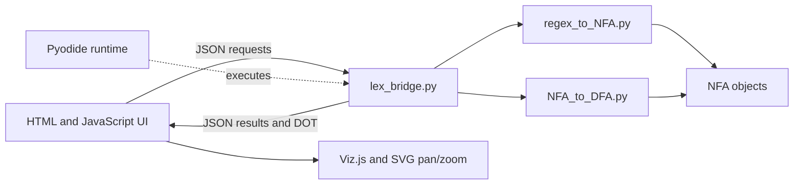

# Architecture

## Design goal

The main design decision is to keep the original Python automata implementation as the source of truth. The browser should explain and operate that code, not replace it with a second lexer written in JavaScript.

## Browser startup

1. `index.html` loads the interface, Pyodide, Viz.js, and SVG pan and zoom support.
2. `js/lexer.js` initializes Pyodide and fetches the three Python source files from `src/lib`.
3. The files are written into Pyodide's in-memory filesystem.
4. `lex_bridge.py` is imported and its public functions are cached by the JavaScript wrapper.
5. The default token list is built so every tab has a working DFA immediately.

The loading screen reports these stages because the first Pyodide download is larger than an ordinary static page load.

## Python modules

### `regex_to_NFA.py`

This module owns regex preprocessing and NFA construction. Its main structures are:

- `State`, with a transition dictionary from a character to a set of target states.
- `accept_State`, which adds a token name.
- `NFA`, which stores the formal automaton components.

It also implements the Thompson operations, epsilon-closure, and NFA combination.

### `NFA_to_DFA.py`

This module owns subset construction and scanning. A `DFA_State` stores the `frozenset` of NFA states it represents and one target per character. Separate subclasses represent accepting and trap states.

The order of the token list is passed into subset construction. When several token accept states occur in the same closure, the first token in that list is selected.

### `lex_bridge.py`

Pyodide can expose Python objects to JavaScript, but a small JSON interface is easier to reason about and test. The bridge provides:

| Function | Purpose |
| --- | --- |
| `build` | Build the token NFAs, combined NFA, and DFA. |
| `scan_text` | Return a full token stream or the first lexical error. |
| `nfa_dot` | Generate Graphviz DOT for one token NFA or the combined NFA. |
| `dfa_dot` | Generate DOT for the DFA. |
| `step_init` | Initialize character-by-character scanner state. |
| `step_advance` | Execute one transition or token emission event. |
| `step_run_to_next_token` | Continue until one token is emitted. |
| `step_run_to_end` | Continue until completion or error. |
| `step_trace_dot` | Generate the chronological path used by the step view. |

Module-level state stores the current build and active stepper. This is acceptable for one in-browser session and avoids repeatedly transferring graph-shaped Python objects across the language boundary.

## JavaScript modules

| File | Responsibility |
| --- | --- |
| `js/main.js` | Bootstrap, build coordination, tabs, and global shortcuts |
| `js/lexer.js` | Promise-based wrapper around Python bridge functions |
| `js/graph.js` | DOT rendering, theme adjustment, and pan and zoom |
| `js/util.js` | Theme, tabs, toasts, status, token colors, and escaping |
| `js/tabs/tokens.js` | Token editing, priority order, persistence, and builds |
| `js/tabs/scan.js` | Source editor, token table, and highlighted source |
| `js/tabs/nfa.js` | NFA controls and rendering |
| `js/tabs/dfa.js` | DFA controls, statistics, and rendering |
| `js/tabs/step.js` | Stepper controls, autoplay, source cursor, and event log |

## State and persistence

The built Python automata live in Pyodide memory. Token specifications, source text, and theme preference are stored in browser local storage. Rebuilding replaces the in-memory automata and updates all dependent tabs.

The application does not send token rules or source text to a server.

## Graph rendering

The Python bridge generates DOT because DOT expresses automata clearly and keeps graph layout separate from automata logic. Viz.js compiles DOT to SVG in the browser. The final SVG is adjusted for the current theme and enhanced with pan and zoom controls.

Large graphs are intentionally capped. This protects the WebAssembly runtime and keeps the interface usable while still reporting the full state count.
